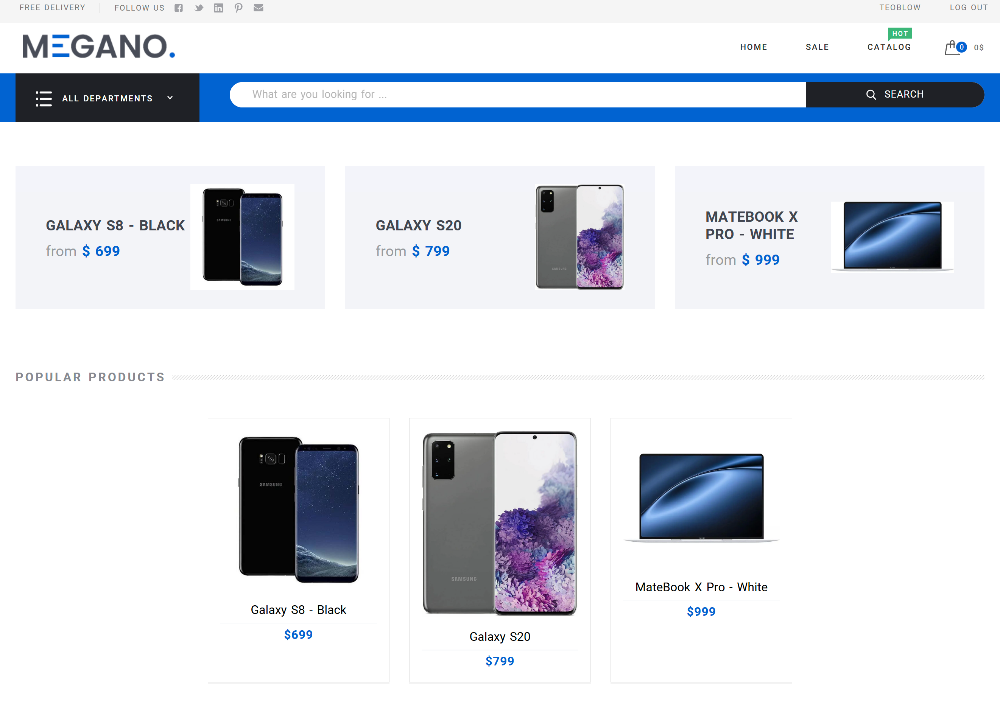

# online_shop_django

Проект большого онлайн магазина на Django.


## Описание

**online_shop_django** — это онлайн магазин, являющийся аналогом citilink.ru. Проект написан на фреймворке Django с использованием базы данных PostgreSQL и отдачей статических файлов через Nginx. Покрыт тестами и линтерами для обеспечения качества и стабильности кода.

В проекте реализованы:
- просмотр и фильтрация каталога товаров,
- оформление и отслеживание заказов,
- управление профилем пользователя в личном кабинете,
- административный раздел для управления магазином.

---

---


## Технологии

- **Python 3.11+** — основной язык программирования
- **Django** — web-фреймворк для реализации бизнес-логики
- **PostgreSQL** — реляционная база данных
- **Nginx** — отдача статических файлов и обратный прокси
- **Docker** — контейнеризация и оркестрация сервисов
- **pytest** — тестирование
- **black, mypy** — автоформатирование и статический анализ кода
- **Pillow** — работа с изображениями


## Особенности и сложности проекта

- **Легкопереносимость**: проект полностью разворачивается через git clone, настройку .env и миграции, все дополнительные сервисы (nginx, docker и др.) конфигурируются из репозитория.
- **Миграции и фикстуры**: реализованы миграции для создания обязательных данных (администратор, роли, тестовые пользователи, товары, категории, заказы, скидки и др.), а также фикстуры для наполнения демонстрационными данными.
- **Документированная установка**: все шаги по развёртыванию и настройке подробно описаны в README.md.
- **Админпанель**: управление интернет-магазином реализовано через Django Admin.
- **Устойчивость к сбоям**: данные хранятся в PostgreSQL, что обеспечивает сохранность между перезапусками. Также реализована система логирования и проведено тестирование.
- **Подключение FrontEnd**: подключён к проекту сторонний FrontEnd, который подходил по ТЗ

## Установка и запуск
1. **Создать файл .env с нужными параметрами**:
Переименуйте файл `.env.example` в `.env` и поменяйте параметры внутри на нужные вам.

### Не забудьте сверить, что данные в `.env` совпадают с `docker-compose.yml` в поле `environment`

2. **Запустить проект**:
```bash
docker-compose up -d
```

Сервис будет доступен по адресу: [http://localhost:8000](http://localhost:8000)

### После запуска у вас не будет создан аккаунт администратора!

Для создания аккаунта администратора, сделайте следующее:

1. **Прописать команду создания суперпользователя**:
```bash
docker-compose exec app python manage.py createsuperuser
```

2. **Создать нового пользователя**:
```bash
Email: somename@mail.com
Username: username
Password: 
Password (again): 
Bypass password validation and create user anyway? [y/N]: y
```

3. **Зайдите в админ панель и работайте с сайтом**:
[http://localhost:8000/admin](http://localhost:8000/admin)


## Конфигурация

Все конфигурационные параметры находятся в файле `.env`.
Без `.env` проект не запуститься. Пример написания `.env` лежит в файле `.env.example`.

Основные настройки `.env`:

| Переменная         | Примеры значений               | Описание                                        |
|--------------------|--------------------------------|-------------------------------------------------|
| `DJANGO_SECRET_KEY`| `ваш_секретный_ключ`           | Секретный ключ Django                           |
| `DEBUG`            | `True`                         | Включить/выключить режим отладки                |
| `ALLOWED_HOSTS`    | `localhost,127.0.0.1`          | Список разрешённых хостов через запятую         |
| `DB_ENGINE`        | `django.db.backends.postgresql`| Движок базы данных Django                       |
| `DB_NAME`          | `online_shop_db`               | Имя базы данных                                 |
| `DB_USER`          | `postgres`                     | Имя пользователя базы данных                    |
| `DB_PASSWORD`      | `password`                     | Пароль пользователя базы данных                 |
| `DB_HOST`          | `db`                           | Хост базы данных (имя сервиса в docker-compose) |
| `DB_PORT`          | `5432`                         | Порт базы данных                                |

Перед запуском в PROD обязательно поменяйте пароли в docker-compose.yml и .env файлах.
